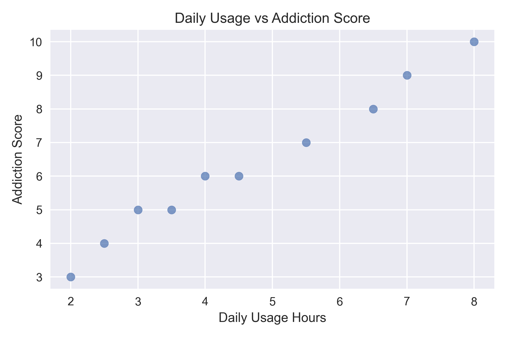

# 📱 Social Media Addiction Analysis in Greece

## 📊 Project Overview
This project analyzes social media usage patterns in Greece and explores how different platforms relate to addiction levels.

The goal is to identify:
- The most used social media platforms
- Differences in addiction levels between platforms
- The relationship between time spent online and addiction

---

## 🛠️ Tools Used
- Python
- Pandas
- Matplotlib
- Jupyter Notebook

---

## ❓ Business Questions
- Which social media platforms are most frequently used?
- Which platform has the highest addiction score?
- Is there a relationship between daily usage hours and addiction level?
- Do higher usage hours lead to higher addiction?

---

## 🔍 Key Insights
- Instagram and Facebook were the most frequently used platforms in the sample.

- TikTok showed the highest average addiction score (9.0), followed by Instagram (7.33), while Facebook had the lowest (4.0).

- There is a very strong positive correlation (0.99) between daily usage hours and addiction score.

- This suggests that increased time spent on social media is strongly associated with higher addiction levels.

---

## 📈 Data Visualization

